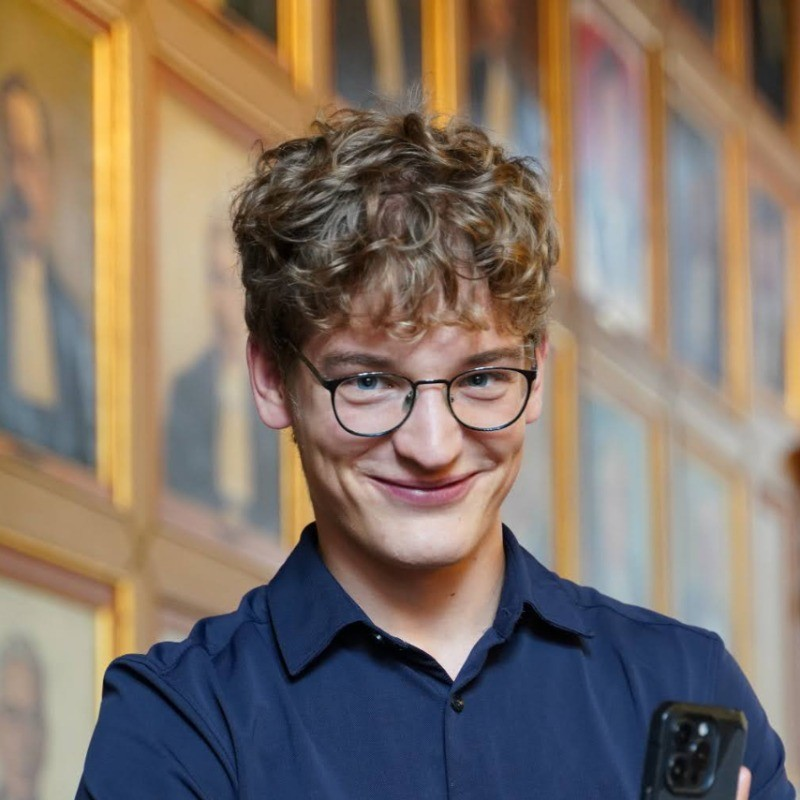

# Michal Tešnar

  
  

      📍 Zürich, Switzerland
      ✉️ michal.tesnar007@gmail.com
  

---

## Personal Profile
I am a machine learning enthusiast with a passion for understanding and creating intelligent systems. I enjoy making these come to life in my programming projects and pondering the possible futures AI might bring us. I am curious about (geo)politics and AI's impact on it.  

My personal passion is communication and learning languages: apart from my mother tongue (Czech) and my study languages (C1: English, Dutch), I also learned German and Spanish (B1) and have started learning Russian (A1).  

---

## Education

### Master of Science in Data Science  
**ETH Zürich, Switzerland**  
📅 September 2024 – Present | **GPA:** 5.25/6  
- **Major Coursework:** Probabilistic Artificial Intelligence, Big Data  
- **Specialization:** Robotics  

### Bachelor of Science in Artificial Intelligence  
**Rijksuniversiteit Groningen, Netherlands**  
📅 September 2021 – June 2024 | **GPA:** 9.3/10  
- Holistic degree combining Computer Science, Machine Learning, Psychology, Philosophy, and Ethics of AI  
- Completed extra courses in Mathematics: Linear Algebra, Calculus, Graph Theory, Analysis, Optimization  
- Participated in ICPC Algorithmic Programming Contests on an international stage  
- **Thesis:** Application of uncertainty quantification in online incremental learning of dynamical models  

### Bachelors Honours Degree  
**Rijksuniversiteit Groningen, Netherlands**  
📅 September 2021 – June 2024 | **GPA:** 9.0/10  
- **Extracurricular Programme:** Focused on personal skills development and broadening academic horizons  
- Conducted research projects in robotics, applying Machine Learning and Model Predictive Control  

---

## Work Experience

### Research Assistant *(Part-time)*  
**Oracle Labs Switzerland – Zürich, Switzerland**  
📅 February 2025 – Present  
- Working in AI/LLM Team  

### Software Engineer *(Part-time)*  
**ASML Netherlands – Veldhoven, Netherlands**  
📅 February 2024 – June 2024  
- Developed and tested factory automation and integration software to prevent human errors and reduce iteration time  
- Wrote Python-based validation rules and test cases, evaluated performance using PyTest and PyLint  
- Coordinated team efforts and workflow  

### Teaching Assistant *(Part-time)*  
**Rijksuniversiteit Groningen – Groningen, Netherlands**  
📅 September 2023 – June 2024  
- Taught **Algorithmic Programming Contests**, preparing students for competitive programming competitions  

### Software Engineer, Driverless Lead *(Part-time)*  
**Hanze Racing Division – Formula Student Team, Groningen, Netherlands**  
📅 May 2022 – June 2023  
- Developed software for a driverless car, focusing on **ROS simulation** and **path-planning algorithms in Python**  
- Progressed to **Driverless Team Lead**, planning projects and coordinating engineers  

---

## Projects

### Perplexity: Online Learning System for Robot Dynamics  
📅 April 2024 – Present | **Research Project, Honours College of Rijksuniversiteit Groningen, in collaboration with DFKI Bremen**  
- Developed a **ROS package** for collecting sensor data from an **autonomous underwater vehicle (AUV) Flatfish**  
- Implemented **uncertainty-aware machine learning models in Keras** for incremental learning of robot dynamics  

### Exploring Double Pendulum Dynamics with Neural Networks  
📅 April 2023 – June 2023 | **Machine Learning Project, Rijksuniversiteit Groningen**  
- Compared **four neural network architectures** for modeling a **double pendulum**  
- Evaluated **Hamiltonian neural networks**, outperforming physics-informed models  

### Faster Than Verstappen: Optimal Racing Using Model Predictive Control  
📅 October 2022 – June 2023 | **Research Project, Honours College of Rijksuniversiteit Groningen**  
- Implemented **MPC-based control algorithm** for racing track navigation  
- Developed MATLAB simulations, project repo: [Racing-MPC](https://github.com/MichalTesnar/Racing-MPC)
